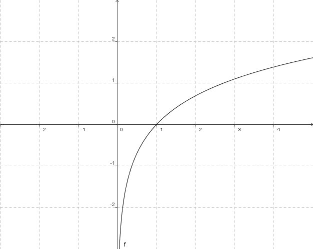

## Sass-LN

Sass-LN is a framework for modularly-scaled responsive layout and optically-aligned typography. It makes extensive use of maps (or 'list-maps') in Sass.

This frame work is still under development, and not documented, but feel free to look around.

